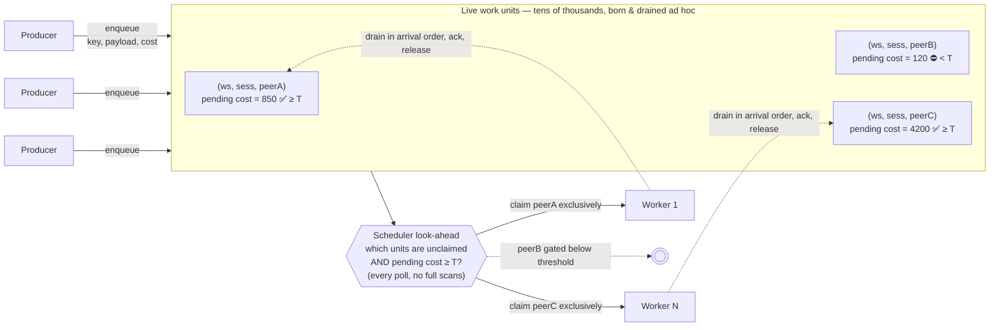
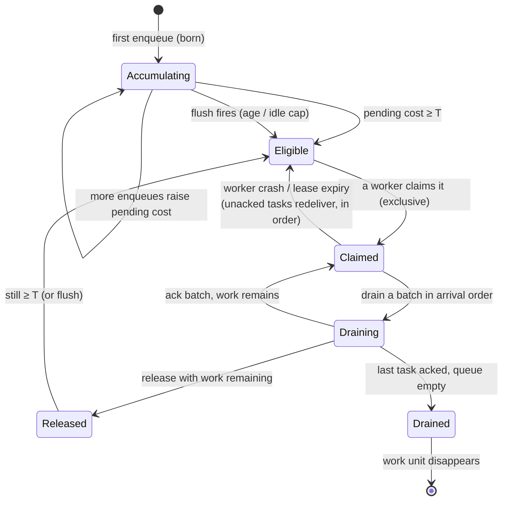
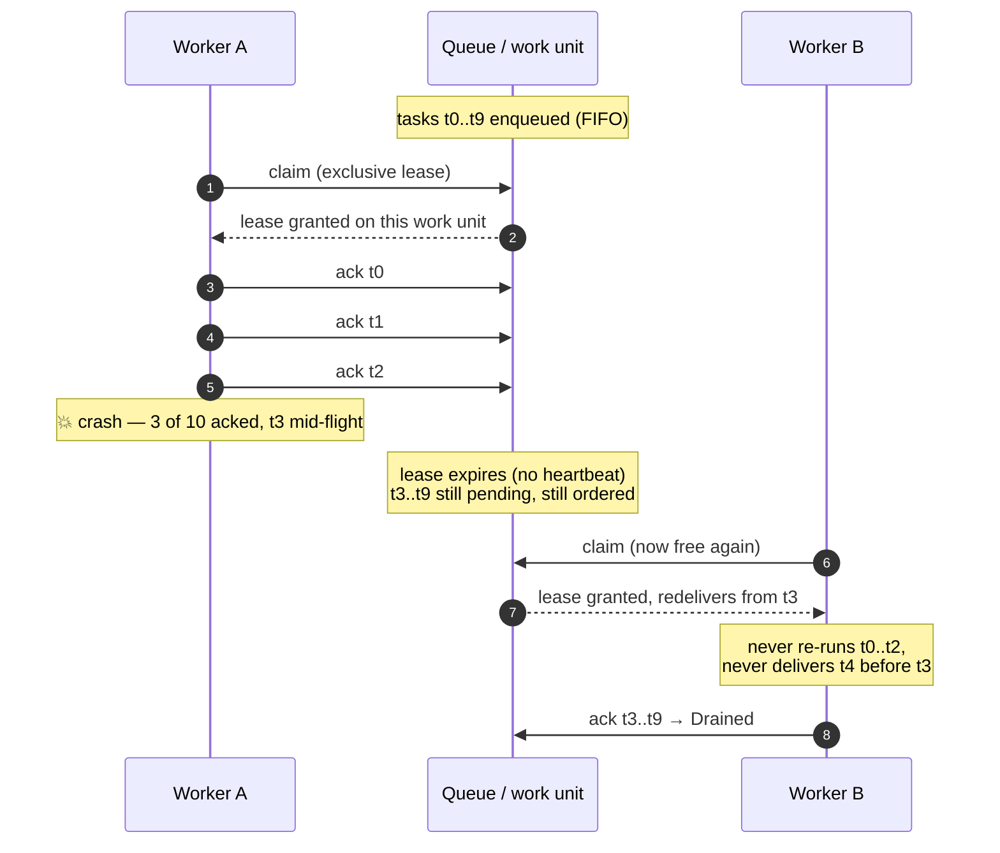

# Platform Engineer Take-Home: Build a Buffered, Work-Unit-Aware Queue

## Context

Plastic Labs builds Honcho — an infrastructure layer for AI agents that gives them memory and a model of the user they're talking to. Almost every piece of useful work passes through a queue: incoming messages, derivation jobs, dream cycles, vector reconciliation. We currently run that on Postgres; it has been "fine" but evolved organically rather than by design. We are very much not claiming it's the right answer.

Our workload has two properties that most off-the-shelf queue systems don't natively handle, and they're the whole point of this screen:

**1. Buffered scheduling (the look-ahead).** The expensive thing downstream is an LLM call, and small batches waste money. So tasks accumulate inside a **work unit**, and the scheduler does a _look-ahead_: it only makes a work unit claimable once the total pending work inside it crosses a buffer threshold (in our case, accumulated token count). The aggregate "how much work is scheduled in this work unit?" question isn't an observability nicety — it's evaluated **continuously, across every work unit, on the scheduling hot path** to decide what's eligible to run. If that query is slow, the whole system is slow.

**2. Strict order within ad-hoc work units.** Every task within a work unit must be processed **in arrival order**, by **at most one worker at a time**. And work units are not a static set: they're keyed by things like `(workspace, session, peer)`, spring into existence on first enqueue, and disappear when drained. A topic-per-key design with pre-declared subscriptions doesn't fit — there's no fixed topic list to subscribe to. Workers have to _discover_ eligible work units at runtime, claim one exclusively, drain a batch in order, and release it.

We want to see what a senior Platform Engineer designs from scratch — backend of your choice — that delivers both properties at high throughput and worker scale.

### The shape of the problem



The two hard parts: the **gate** (only peerA/peerC are claimable; peerB waits) and **exclusive in-order draining** (each claimed unit is owned by exactly one worker, processed FIFO).

## Vocabulary

- **Task** — a single job. Carries a `work_unit_key`, a payload, and an integer `cost` (think token count).
- **Work unit** — the ordered stream of tasks sharing a `work_unit_key`. Created implicitly on first enqueue; gone when drained. There may be tens of thousands live at once.
- **Buffer threshold** — minimum total pending `cost` before a work unit becomes eligible to be claimed.

### Anatomy of one work unit (the buffered gate)

```
   work_unit_key = (workspace, session, peer)

   arrival order  ───────────────────────────────────────▶   (FIFO, drain from the left)

   ┌────────┬────────┬────────┬────────┬────────┐
   │  t0    │  t1    │  t2    │  t3    │  t4    │   tasks
   │ cost   │ cost   │ cost   │ cost   │ cost   │
   │  200   │  150   │  300   │  120   │   80   │
   └────────┴────────┴────────┴────────┴────────┘
        └──────── pending cost = 850 ────────┘

   threshold T = 500
   850 ≥ 500   ⇒  ELIGIBLE        (claimable by exactly one worker)
   ...but if it had stalled at 280 < 500, the flush path is the ONLY
   way it ever runs — otherwise it strands forever.
```

The look-ahead question — *"which units have pending cost ≥ T and are unclaimed?"* — is asked against **every** such unit, **every** poll cycle. The aggregate (`850`) must be maintained, not recomputed by scanning tasks.

## The Task

Design and build a work queue that supports:

1. **Enqueue.** `enqueue(work_unit_key, payload, cost)`. No pre-registration of work units — first enqueue creates one.
2. **Buffered claim.** A worker asks for work and receives an **eligible** work unit: one that is unclaimed and whose total pending cost ≥ threshold. The claim is **exclusive** — at most one worker owns a work unit at any moment.
3. **In-order processing.** The owning worker drains tasks from its work unit in strict arrival order (up to a batch cap), acks them, then releases the claim or continues. Order must hold across claim/release cycles and across worker crashes.
4. **Parallel across work units.** N workers process N different work units concurrently with zero ordering interference.
5. **Cheap look-ahead.** "Which work units have ≥ T pending cost and are unclaimed?" must stay cheap with millions of pending tasks across tens of thousands of work units. No full scans on the hot path. The per-work-unit aggregate should also be queryable on its own (we surface it for routing and billing).
6. **Flush policy.** A work unit that accumulates slowly can't wait forever below the threshold. Design a flush mechanism (idle timer, age cap, explicit flush — your call) and defend it.
7. **A load generator** that demonstrates the system at scale — including work-unit churn (keys constantly created and drained) — and produces reportable numbers.

### Lifecycle of a work unit



Note the two ways out of `Accumulating` (threshold *or* flush) and the crash edge from `Claimed` back to `Eligible` — ordering must survive that round trip.

**Backend choice is yours.** Postgres, Redis, Kafka/Redpanda, NATS, an in-memory engine with a write-ahead log, a custom protocol — anything you can defend. **The choice itself is part of the screen.** Note that the two core properties above are exactly where naive uses of popular systems fall down (consumer groups don't give you cost-threshold gating; topic-per-key dies under churn). We want to hear why you picked what you picked, what you had to build _on top_ of it, and what your second choice would have been.

## What "good" looks like

- **Ordering is provable.** Under N concurrent workers and forced claim churn (claim → partial drain → release → re-claim, plus crash injection), tasks for a single work unit still complete in arrival order. Demonstrated with a deterministic test, not vibes.
- **The gate is provable.** No work unit is processed below threshold except through the flush path — and the flush path is demonstrated too. Show the test.
- **The look-ahead is cheap.** Eligibility evaluation cost should be near-independent of total queued tasks. Show how it behaves at 10⁶ pending tasks / 10⁴–10⁵ live work units. No `SUM(...) GROUP BY` over millions of rows per poll.
- **Throughput scales with workers.** A graph across worker counts (1, 10, 100, 1000?). Where does it plateau? Why? Defend the plateau.
- **Failure modes addressed.** Worker crash mid-batch (what redelivers, and does order survive?), hot work unit (one key gets 100× the traffic), stranded work unit (never hits threshold), poison task. Pick the ones you think matter most and ship them; defend what you skipped.
- **Backend choice is defensible.** Walk us through why this beats the obvious alternatives for _these two properties specifically_. "I picked X because Y," not "I picked X because it's what I know."
- **Operationally feasible.** Something a real team could run in production, not a thesis project. Deployment, monitoring (queue depth, eligible-unit count, oldest-below-threshold age), recovery, upgrades.

### The ordering-under-crash scenario (you'll be asked this live)



The thing to prove: **no task is processed twice, and none out of order**, across the crash. That's the heart of the screen — demonstrate it deterministically, not by argument.

## Deliverables

- The repo, with **incremental commits** — we'll read the history, not just the final state
- The load generator and its reported numbers
- A **1-page writeup**, including the **distributed extension design** as a stretch discussion

Timeline is agreed at the kickoff call based on your availability, and we grade accordingly.

## Constraints

- **No backend is prescribed.** Pick what you'd actually deploy in production.
- **Hard budget**: ~$20 cloud spend if you need a beefy box for the load test. Should otherwise run on a laptop. Track and report any cloud usage.
- **Writeup capped at 1 page.** The code, the load-test numbers, the operability story, and the live walkthrough are the deliverables. Not the doc.
- **The look-ahead must be a first-class operation.** No "you can compute the aggregate but it's slow." The scheduler depends on it every poll cycle.
- **Reproducibility**: we clone, run the load test, see comparable numbers. Pin your environment.

## What we're explicitly _not_ looking for

- A wrapper around an existing queue library (rq, celery, BullMQ, dramatiq, etc.) — we want the queue itself, not a job runner sitting on top of one
- A topic-per-key design that assumes a static topic set — work units are created and destroyed ad hoc, at high rates
- A consumer-group design that hand-waves the threshold gate — "process whatever arrives" is exactly what we're moving away from
- A literature survey of queue systems
- A toy that breaks under real concurrency — single-threaded benchmarks don't count
- A solution that requires building a consensus protocol from scratch — the operational story matters, but a reimplementation of Raft is not the point

## Final review

30-minute screen share. You'll run the load test live and walk us through the numbers. We'll ask:

- Why this backend? What's your second choice and why didn't it win?
- How is the eligibility check implemented, and what's its cost as pending tasks and live work units grow? What did you precompute, and what does keeping that aggregate correct cost on the enqueue path?
- A worker crashes mid-batch with 3 of 10 tasks acked. What happens, in order, until that work unit is healthy again? Can a task ever be processed out of order or twice?
- How do you handle a hot work unit (100× the traffic)? A wedged one (claimed, worker not progressing)? One that never reaches threshold?
- What does "fairness" mean in your system, and where does it break when many units cross the threshold simultaneously?
- If the threshold changed at runtime (per-tenant, even), what would you have to touch?
- Where does throughput plateau, and what's the first bottleneck you'd attack to push past it?
- How would you extend this to run across multiple machines (sharding strategy, cross-shard work-unit ownership, failure isolation)?
- If we 10×'d the worker count tomorrow, what breaks first?

Be ready to defend the **backend choice**, the **look-ahead mechanism**, and the **operability story**. Those are the most interesting decisions on this project.

## Resources

- Any backend you can stand up: Postgres, Redis, Kafka/Redpanda, NATS, SQLite, custom, etc.
- Any language you're comfortable shipping production code in (we'll be reading it)
- Any load-testing tool (k6, locust, vegeta, custom — your call)
